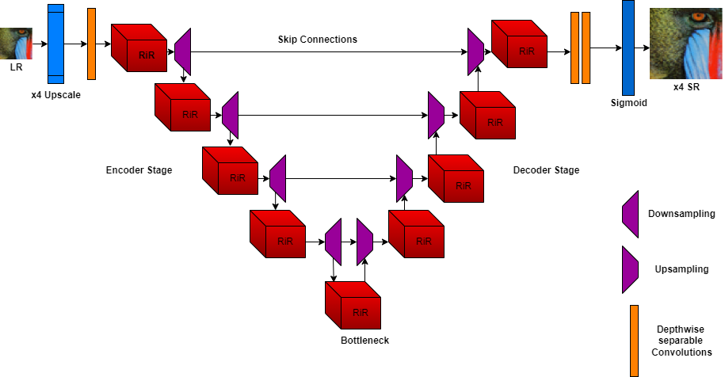

# **Super-Resolution Image Reconstruction: A Comparative Analysis of Loss Functions**  

## 📌 **Overview**  
This project explores the impact of different loss functions on **Single Image Super-Resolution (SISR)** for **4x upscaling**, using a **UNet architecture with residual-in-residual (RiR) blocks**. The study evaluates common loss functions like **L1 (MAE)** and **L2 (MSE)** alongside less common ones such as **Tukey loss, Charbonnier loss, Total Variation (TV) loss, and Structural Similarity Index Measure (SSIM) loss**.  

## 🎯 **Project Aim**  
- Develop a **UNet-based SISR model** with **residual-in-residual (RiR) blocks** to enhance image resolution while also improving it's quality.  
- Compare **pixel-based loss functions** (e.g., MAE, MSE) with **perceptual losses** (e.g., SSIM) for high-quality image reconstruction.  
- Analyze the impact of each loss function on **image quality, detail preservation, and artifact reduction**.  

## 📂 **Repository Structure**  
This repository contains all necessary code and resources for training, testing, and evaluating the SISR models:  

### **1️⃣ Model & Training Code**
- **`sisr_training_final.ipynb`** → Main notebook for training models.  
- **`model.py`** → U-Net model architecture.  
- **`preprocess.py`** → Pre-processing class for dataset preparation.  
- **`patch_extractor.py`** → Extracts low-resolution and high-resolution patches from datasets.  

### **2️⃣ Model Evaluation**
- **Testing Notebooks** (each corresponding to a specific test set):  
  - `Testing_BSD100.ipynb`  
  - `Testing_manga109.ipynb`  
  - `Testing_Set5.ipynb`  
  - `Testing_Set14.ipynb`  
  - `Testing_urban100.ipynb`  
- **Metric Results**:  
  - Located in the **`results/` folder** as CSV files (one per test set).  
  - Each CSV file contains metric results, with **average values at the end**.  
- **Loss Curves**:  
  - `loss_curves_visualization.ipynb` → Contains visualized loss and metric curves vs. epochs for each model.  
- **TensorBoard Logs**:  
  - Stored in **`tensorboard_runs/` folder** (logs of all model runs).  

## 🏗 **Model Architecture**  

- **Encoder-Decoder UNet** with skip connections for multi-scale feature extraction.  
- **Residual-in-Residual (RiR) blocks** with **inception modules** for deep hierarchical feature learning.  
- **Pre-Upsampling Strategy**: LR images are upsampled before being passed into the network.  
- **Final Output Layer**: Two convolutional layers followed by a **Sigmoid activation** to stabilize pixel values.

  
*UNet Model Architecture*    
  
*RiR Block*    
  
*Inception Block*   

## 📂 **Dataset**  
Training & validation:  
- **DIV2K** (Diverse high-resolution image dataset)  
- **Flickr2K** (High-resolution images from Flickr)  

Testing:  
- **BSD100** (Natural images)  
- **Manga109** (Illustrations & complex textures)  
- **Set5, Set14** (Standard benchmark datasets)  
- **Urban100** (Urban scenes with structural details)  

## 🧪 **Loss Functions Evaluated**  
| Loss Function | Type | Characteristics |  
|--------------|------|----------------|  
| **MSE (L2)** | Pixel-wise | Penalizes large errors, but can smooth details |  
| **MAE (L1)** | Pixel-wise | Produces sharper images, less sensitive to outliers |  
| **Charbonnier** | Robust | A smooth approximation of L1, robust to noise |  
| **Tukey Loss** | Robust | Suppresses outliers, reduces artifacts |  
| **TV Loss + MAE** | Regularization | Encourages spatial smoothness while preserving edges |  
| **SSIM + MAE** | Perceptual | Balances perceptual similarity with pixel accuracy |  

## 📊 **Evaluation Metrics**  
- **Peak Signal-to-Noise Ratio (PSNR)**: Measures pixel-wise reconstruction accuracy.  
- **Structural Similarity Index Measure (SSIM)**: Assesses perceptual similarity & structural consistency. 

## 🔄 Preprocessing Steps
- **Patch Extraction:**  
  - Divide high-resolution images into 256x256 patches.  
  - Create low-resolution patches (64x64) by bicubic downsampling (factor 4).
- **Data Augmentation:**  
  - Apply random horizontal and vertical flips (50% probability each).  
  - Use random rotations (0°, 90°, 180°, or 270°) with equal probability for each.
  - These augmentations are applied with an overall probability of 30% during training, ensuring both HR and LR images remain paired and consistent.
- **Tensor Conversion:**  
  - Convert patches to PyTorch tensors using `ToTensor()` (normalizing pixel values to [0, 1]).
- **Batch Collation:**  
  - Use a custom collation function to pair HR and LR patches for efficient batching.

## 🚀 **Training Setup**  
- **Batch Size**: 16 (except for SSIM + MAE, where batch size = 8)  
- **Optimizer**: Adam (initial LR = `1e-4`, except for MAE & TV+MAE with `5e-5`)  
- **Scheduler**: ReduceLROnPlateau (reduces LR by 0.5 if no improvement in 3 epochs)  
- **Early Stopping**: Stops training after 5 epochs of no improvement  
- **GPU Acceleration**: Trained on NVIDIA Tesla T4 (15GB VRAM)  

## 📈 **Results & Findings**  
### Table. Quantitative Analysis of All the Trained Models

| Loss Function | Set5 PSNR | Set5 SSIM | Set14 PSNR | Set14 SSIM | BSD100 PSNR | BSD100 SSIM | Urban100 PSNR | Urban100 SSIM | Manga109 PSNR | Manga109 SSIM |
|---------------|-----------|-----------|------------|------------|-------------|-------------|---------------|---------------|---------------|---------------|
| MAE (L1)    | 31.2283   | 0.8566    | 26.6152    | 0.7641     | 26.2439     | 0.7195      | 25.5575       | 0.7525        | **21.0333**       | 0.7106        |
| MSE (L2)    | 31.4060   | 0.8576    | 26.7263    | 0.7658     | 26.3661     | 0.7229      | **25.7684**       | 0.7574        | 20.9606       | 0.7080        |
| Tukey       | 31.3176   | 0.8590    | 26.6552    | 0.7660     | 26.3216     | 0.7225      | 25.6909       | 0.7585        | 20.9605       | 0.7106        |
| Charbonnier | 31.4831   | 0.8605    | **26.7361**    | 0.7678     | **26.3672**     | 0.7234      | 25.6133       | 0.7560        | 21.0211       | **0.7126**        |
| TV + MAE    | 31.3248   | 0.8569    | 26.6575    | 0.7644     | 26.2759     | 0.7205      | 25.5231       | 0.7538        | 20.9900       | 0.7093        |
| SSIM + MAE  | **31.4853**   | **0.8640**    | 26.6860    | **0.7754**     | 26.2479     | **0.7372**      | 25.7384       | **0.7747**        | 20.8003       | 0.7105        |

### Qualitative Analysis of All the Trained Models
*Below is a brief qualitative summary, highlighting the strengths and weaknesses of each loss function:*
- **MAE (L1):**  
  - **Strengths:** Produces sharper edges and well-defined textures—excelling on natural scenes.  
  - **Weaknesses:** May introduce noticeable noise in highly detailed or low-contrast regions.
- **MSE (L2):**  
  - **Strengths:** Yields smoother outputs, which works well for images with subtle gradients (e.g., urban scenes).  
  - **Weaknesses:** Tends to over-smooth and lose fine details in images with rich textures (e.g., manga or intricate artworks).
- **Tukey Loss:**  
  - **Strengths:** Effectively suppresses outliers, maintaining balanced overall structure in natural images.  
  - **Weaknesses:** May underperform in capturing very fine details in highly complex textures.
- **Charbonnier Loss:**  
  - **Strengths:** Offers a robust balance between smoothness and detail preservation—good for a variety of scenes.  
  - **Weaknesses:** Sometimes struggles with retaining the crispness of edges in extremely intricate regions.
- **TV + MAE:**  
  - **Strengths:** Reduces artifacts and noise, producing clean and smooth results—beneficial for noisy images.  
  - **Weaknesses:** Over-smoothing can lead to a loss of critical fine details in textured or high-frequency regions.
- **SSIM + MAE:**  
  - **Strengths:** Enhances structural fidelity and perceptual quality, making it ideal for maintaining overall scene structure.  
  - **Weaknesses:** May sacrifice some pixel-level precision in areas with extremely high detail and takes longer time to train due to complex SSIM calculations.

  
*Results on a patch extracted from Set14 dataset*   

  
*Results on a patch extracted from Urban100 dataset*   

  
*Results on a patch extracted from Manga109 dataset*  

## ⚠️ Limitations and Future Work
- **Limited Training Data:**  
  Only 21,000 patches were used from the DF2K dataset due to resource constraints, potentially impacting generalization.
  Training on the full DF2K dataset (around 120,000 patches) could enhance the model's generalization across diverse image types.
- **Model Architecture Constraints:**  
  The absence of attention mechanisms due to resouce constraints limited the model’s ability to capture fine details, particularly in complex images (e.g., BSD100 and Urban100).
  Adding non-local or channel attention or utilizing Vision Tranfoermers (ViTs) could help the model capture finer details and complex textures, improving perceptual quality and SSIM.
- **Restricted Loss Function Exploration:**  
  Advanced perceptual loss functions like LPIPS and VGG-based perceptual loss were not tested due to their computational complexity, which may have improved perceptual quality.
  Integrating these losses may produce sharper, more visually appealing outputs, especially for challenging datasets.
- **Dataset-Specific Challenges:**  
  The model underperformed on highly detailed artworks (Manga109), suggesting the need for either fine-tuning on specialized datasets or enhance architectural features.

